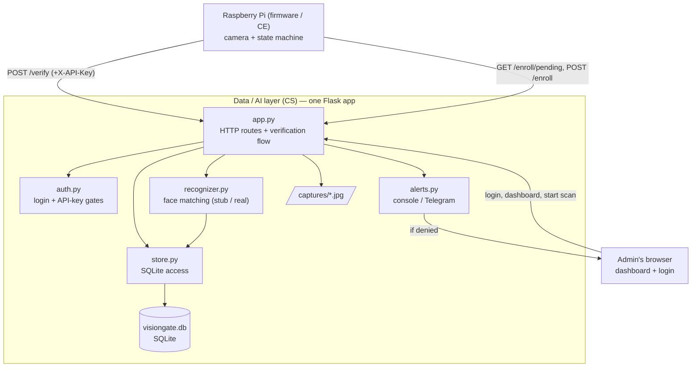
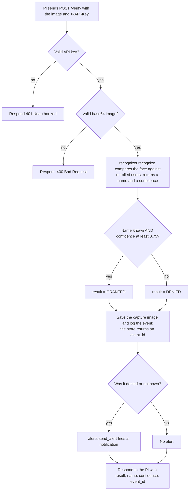
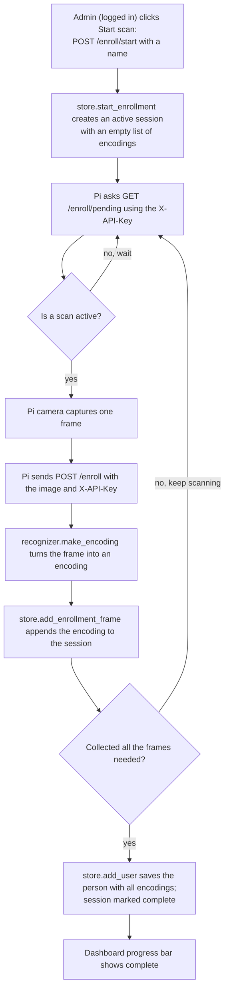
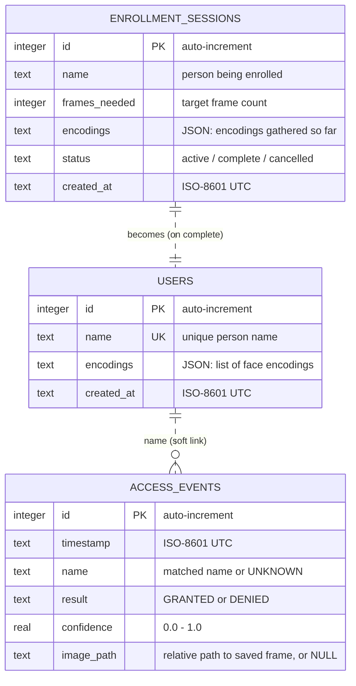
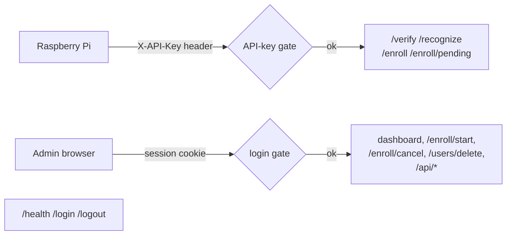

# VisionGate — Data / AI Layer Deep Dive (CS side)

This document explains the **CS layer in full detail**: how it works, every
moving part, the database tables, and the flows — with diagrams. If the
[root README](../README.md) is the "what," this is the "how and why."

This layer is one program: a small **Flask web server** (`app.py`) that the
Raspberry Pi talks to over the network. It does five jobs:

1. **Recognize** a face from an image.
2. **Decide** GRANTED / DENIED using a confidence threshold.
3. **Store** every attempt and every registered person in a SQLite database.
4. **Show** it all on a live web dashboard.
5. **Alert** an admin when someone is denied/unknown.

Plus two supporting jobs: **enroll** new faces from the camera, and **protect**
everything with a login + an API key.

---

## 1. The big picture



Everything is **mock-first**: with `RECOGNIZER_BACKEND = "stub"` the whole thing
runs on a laptop with no camera and no AI libraries. Flip one switch to use the
real `face_recognition` engine on the Pi.

---

## 2. Files and what each one does

| File | Responsibility |
|---|---|
| `app.py` | The Flask app. Defines every HTTP route, runs the verify flow, and serves the dashboard. The "front desk." |
| `recognizer.py` | Turns an image into a decision. Two interchangeable backends (`stub`, `face_recognition`) behind one function. The "brain." |
| `store.py` | All SQLite reads/writes: users, events, enrollment sessions, retention. The "filing cabinet." |
| `auth.py` | Two security gates: a session **login** for admins, an **API key** for the Pi. The "locks." |
| `alerts.py` | Sends a notification on denied/unknown attempts (console file now, Telegram optional). The "alarm." |
| `enroll.py` | Command-line tool to enroll a face from an image file (offline alternative to the camera scan). |
| `config.py` | All settings and secrets (with `.env` support). Change behavior here, not in code. |
| `serve.py` | Runs the app under Waitress (a real production web server). |
| `templates/dashboard.html` | The live dashboard page (auto-refreshes every 2s). |
| `templates/login.html` | The admin login page. |
| `tests/` | Automated tests (`pytest`) for the recognizer, store, and HTTP contract. |

---

## 3. The verification flow (the main event)

This is what happens every time the Pi checks a face. It is the single most
important path in the system.



Read it top to bottom: each diamond is a check, each box is an action.

**Step 4 is the policy** and it's deliberately strict:
- The face must match a **registered** user (not `UNKNOWN`), **and**
- the match `confidence` must be **≥ `CONFIDENCE_THRESHOLD`** (default `0.75`).
- Anything else → **DENIED**. There is no "maybe."

This is why the firmware can safely trust a single `result` field.

---

## 4. The enrollment flow (camera scan)

Enrolling a face is a little dance between the admin's browser and the Pi,
coordinated through the database. The browser **starts** a scan; the Pi
**fills** it; the server **finalizes** it into a user.



The arrows looping back to "GET /enroll/pending" are the capture loop: the Pi
keeps capturing frames until enough are collected, then the user is created.

Storing **multiple frames per person** makes matching more robust — the real
`face_recognition` backend compares a new face against *all* of a user's
samples and uses the closest one.

---

## 5. The database

SQLite, a single file (`visiongate.db`). Three tables, created automatically on
first run by `store.init_db()`.



> **Note on the links:** there are no enforced foreign keys. `access_events.name`
> is just text — it records *who the recognizer said it was* at that moment,
> even `UNKNOWN`. Keeping events independent of the users table means deleting a
> user never erases their access history. An `enrollment_sessions` row "becomes"
> a `users` row when it completes.

### Table: `users` — the registered people

One row per enrolled person.

| Column | Type | Meaning |
|---|---|---|
| `id` | INTEGER PK | Auto-increment id |
| `name` | TEXT UNIQUE | The person's name (also the dashboard label) |
| `encodings` | TEXT | A **JSON list of encodings**. Each encoding is a list of numbers describing a face. Stub backend = 8 numbers; real backend = 128 numbers. Multiple per person. |
| `created_at` | TEXT | When enrolled (ISO-8601, UTC) |

Example row (stub backend, 2 samples):
```json
{ "id": 1, "name": "Ali",
  "encodings": [[0.51,0.12,...8 nums], [0.49,0.13,...8 nums]],
  "created_at": "2026-06-13T23:56:25Z" }
```

### Table: `access_events` — the audit log

One row per verification attempt. This is what the dashboard and stats read.

| Column | Type | Meaning |
|---|---|---|
| `id` | INTEGER PK | Auto-increment id (returned to the Pi as `event_id`) |
| `timestamp` | TEXT | When it happened (ISO-8601, UTC) |
| `name` | TEXT | Matched name, or `UNKNOWN` |
| `result` | TEXT | `GRANTED` or `DENIED` |
| `confidence` | REAL | Match confidence, `0.0`–`1.0` |
| `image_path` | TEXT | Path to the saved frame, or `NULL` (e.g. when a stranger's photo isn't stored) |

### Table: `enrollment_sessions` — in-progress scans

Short-lived rows that track a camera scan while it's filling up. Only one is
`active` at a time. When it reaches `frames_needed`, the server creates the
`users` row and flips this to `complete`.

---

## 6. The recognizer in detail

`recognize(image_bytes)` returns a `RecognitionResult(name, confidence)`.
Two backends, chosen by `config.RECOGNIZER_BACKEND`:

### `stub` (default — laptop/dev)
- **No camera or AI needed.** It hashes the image bytes (SHA-256) and uses that
  to *deterministically* pretend to recognize.
- `STUB_RESULT` lets you script it: `"GRANTED"`, `"DENIED"`, a specific name, or
  `"auto"` (hash decides: ~78% of inputs map to a registered user, the rest to
  `UNKNOWN`).
- The "confidence" it reports is fake but realistic-looking — useful for demos.

### `face_recognition` (real — the Pi)
- Uses the `face_recognition` library (dlib) to compute a real **128-number
  encoding** of the face in the image.
- Compares it against **every encoding of every enrolled user** using
  `face_distance` (lower distance = more similar).
- Picks the closest. If the distance is within `FACE_MATCH_TOLERANCE` (0.6) it's
  a match; confidence is mapped from the distance (`1 - distance/tolerance`).
- If no face is found in the image → `UNKNOWN`.

Either way, `app.py` then applies the same `CONFIDENCE_THRESHOLD` policy, so the
rest of the system doesn't care which backend is running.

---

## 7. Security model (two independent gates)



| Endpoint | Who calls it | Protection |
|---|---|---|
| `POST /verify`, `POST /recognize` | the Pi | **API key** (`X-API-Key`) |
| `GET /enroll/pending`, `POST /enroll` | the Pi | **API key** |
| `GET /` (dashboard) | admin browser | **login** (redirects to /login) |
| `POST /enroll/start`, `/enroll/cancel`, `/users/delete` | admin browser | **login** (401 if not) |
| `GET /api/events`, `/api/stats`, `/api/users`, `/api/enroll/status` | dashboard JS | **login** (401 if not) |
| `GET /health`, `/login`, `/logout` | anyone | open |

- The **API key** is a shared secret; the Pi and server must use the same value.
  It proves "this request is from our device," not a random stranger on the network.
- The **admin login** is a username + password (the password is stored *hashed*,
  never in plain text), with a signed session cookie.
- Both secrets live in a git-ignored `.env` file (see `.env.example`).

---

## 8. Alerts, retention, and privacy

- **Alerts** (`alerts.py`): on every DENIED/UNKNOWN event, `send_alert()` fires.
  Default backend writes to the console and `alerts.log`; set
  `ALERT_BACKEND = "telegram"` (plus token/chat id) to get phone notifications.
  Alerting never crashes the request — a failed alert is logged and ignored.
- **Retention** (`store.purge_old_data`): on startup, events and their saved
  images older than `CAPTURE_RETENTION_DAYS` (default 7) are deleted. Set to `0`
  to keep everything.
- **Privacy** (`STORE_UNKNOWN_CAPTURES`): when `False`, frames from denied/unknown
  attempts are **not** written to disk — the event is still logged, just without
  a photo. Avoids hoarding pictures of strangers.

---

## 9. How the dashboard gets its numbers

The dashboard page polls three JSON endpoints every 2 seconds and redraws —
no full page reload.

| Endpoint | Backed by | Shows |
|---|---|---|
| `/api/stats` | `store.get_stats()` | KPI cards: total / granted / denied / deny-rate / user count |
| `/api/events` | `store.get_recent_events()` | The recent-attempts table (newest first) |
| `/api/users` | `store.get_users()` | Registered users + how many face samples each has |
| `/api/enroll/status` | `store.get_active_enrollment()` | The scan progress bar |

`get_stats()` is a single SQL aggregate:
```sql
SELECT COUNT(*) AS total,
       SUM(result = 'GRANTED') AS granted,
       SUM(result = 'DENIED')  AS denied
FROM access_events;
```
(`deny_rate = denied / total`.)

---

## 10. Configuration reference (`config.py`)

| Setting | Default | What it does |
|---|---|---|
| `HOST` / `PORT` | `0.0.0.0` / `8000` | Where the server listens (8000 matches the firmware) |
| `RECOGNIZER_BACKEND` | `stub` | `stub` or `face_recognition` |
| `CONFIDENCE_THRESHOLD` | `0.75` | Minimum match confidence to GRANT |
| `STUB_RESULT` | `auto` | Scripts the stub: `auto` / `GRANTED` / `DENIED` / a name |
| `FACE_MATCH_TOLERANCE` | `0.6` | dlib distance cutoff (real backend) |
| `ENROLL_FRAMES_NEEDED` | `5` | Frames captured per camera scan |
| `CAPTURE_RETENTION_DAYS` | `7` | Auto-delete events/images older than this (`0` = keep) |
| `STORE_UNKNOWN_CAPTURES` | `True` | Save photos of denied/unknown faces? |
| `ALERT_BACKEND` | `console` | `console` or `telegram` |
| `API_KEY` | env / demo | Shared key the Pi must send |
| `ADMIN_USERNAME` / `ADMIN_PASSWORD` | env / demo | Dashboard login |
| `SECRET_KEY` | env / demo | Signs the session cookie |

Secrets (`API_KEY`, `ADMIN_PASSWORD`, `SECRET_KEY`, Telegram) should be set via
the `.env` file, never committed.

---

## 11. Testing

`python -m pytest -q` runs 21 tests (see `tests/`) against a throwaway temp
database, covering:
- **recognizer** — deterministic encodings, forced grant/deny, threshold policy
- **store** — user round-trips, event stats, enrollment-session lifecycle, retention
- **api** — auth gates (401), bad input (400), grant/deny shape, full enrollment flow

---

## 12. Extending it

- **Swap in a different model:** add a backend function in `recognizer.py` and a
  new `RECOGNIZER_BACKEND` value. Nothing else changes.
- **Add an alert channel:** add a `_send_x()` in `alerts.py` and a new
  `ALERT_BACKEND` value.
- **New dashboard metric:** add a query in `store.py`, expose it as an
  `/api/...` route, and fetch it in `dashboard.html`.
